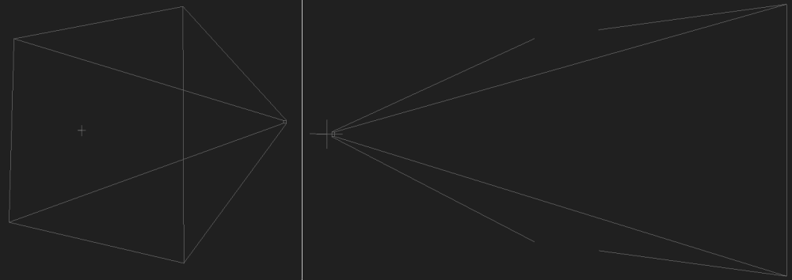

# Working with cameras in CraftStudio

This tutorial will teach you some of the (simple) maths behind the relations between the textures pixels, the screen pixels and the scenes units in [CraftStudio](http://craftstud.io).

You will learn how to convert from units to pixels for both orthographic and perspective cameras in order to know if a game object is visible from a camera or where it appears on the screen.

Some definitions :

- su : scene units
- tpx : texture pixels
- px : screen pixels
- SSS (Smallest Screen Size) Size in pixels of the smallest side of the screen (usually the height)
- frustum : the world space that is seen by a camera (you see an objet only when it is inside a camera's frustum). In the scene editor, frustum boundaries are marked by grey outlines going from the camera's game object :

- [Texture pixels](#texture)
- [Size of an object in the world](#size-in-world)
- [Orthographic cameras](#orthographic-cameras)
- [Perspective camera](#perspective-cameras)
- [Relative position vs Local position](#relative-vs-local)
- [Daneel to the rescue](#daneel)

## Texture pixels

The base relation between texture pixels and scene units is : __16 tpx = 1 su__.

## Size of an object in the world

All relations are for a single axis.

### Models

Given a single model block :

    Size (su) = block size (tpx) / 16 * stretch * game object scale

### Maps

For a single map block :

    Size (su) = tile size (tpx) / 16 * game object scale

Get the tile size with `tileSet:GetTileSize()`.  
The size in each axis also depends on the block's shape.

### Fonts

    Size (su) = text width (su) * game object scale

Get the text's width with `textRenderer:GetTextWidth()`. The returned width is always the width when the game object has a global scale of 1.

This is for the width only (the game object's local X axis).  
The height depends on the font's characters height (and the game object's scale on the Y axis). There is no way to get this data via script but it will most likely be `1.5 * character width`.

## Orthographic cameras

__The orthographic scale is the size in scene unit of the smallest side of the screen.__

    orthographic scale (su) <=> SSS (px)

This gives you the relation between the scene units and the screen pixels.

    unitsToPixels (px/su) = SSS (px) / orthographic scale (su)
    pixelsToUnits (su/px) = orthographic scale (su) / SSS (px)

    object size (px) = object size (su) * unitsToPixels (px/su)
    object size (px) = object size (su) / pixelsToUnits (su/px)

### Finding out if a game object is visible

Here is two methods to find out if a game object is visible from a camera.  
Or to say it in a better way : find out if a position is inside the camera's frustum.

#### 1 - The Mask

The mask is a model that has exactly the size of the camera's frustum (if the model wasn't transparent, it would fill the whole screen).  
The mask model must be a single block with a block size of 16 (0 in z axis), centered on the model's origin.

Scale your mask game object as follow :

    object scale = screen size * pixelsToUnits
    (most of the time 'screen size.y = SSS', so the last relation is just 'object scale.y = orthographic scale')

The easiest way to position the mask is to make it a child of the camera's game object then put it at a local position of `0, 0, 0`.

Create a ray from the position you want to check in the direction of the camera so that the ray is perpendicular to the mask.  
If the camera is not rotated, the direction should be `0, 0, 1` (because cameras always look toward the negative Z).

Then check for the intersection of the ray with the mask. The position is inside the frustum if the ray intersects the mask.

#### 2 - Compare world position

Get your object relative position to the camera :
    
    Generic relation :
    relative position = child position - parent position

__Note that the position of a child relative to a parent is the same as the direction from the parent to the child.__

    In our case :
    relative position = object position - camera position

We need to check if the relative position's X and Y components are within acceptable range.  
Since the camera's position is the center of the frustum, the range is the half width and half height in scene units of the frustum.

    range = screen size / 2 * pixelsToUnits
    
Your object is inside the camera's frustum if :

    -range.x <= relative position.x <= range.x
    -range.y <= relative position.y <= range.y
    relative position.z <= 0 

### Translating from world position to screen position

It can be very useful to know where an object in the 3D world appear on the screen.  
This can be used to put an icon on the HUD to mark the position of an objective, so that players always know where it is even if the objective is hidden by the environment, for instance.  

This is very simple since all you have to do is convert the object's relative position from scene units to pixels but you also have to consider two things :

- The origin of the screen is not its center, but its top-left corner.
- Consequently, the Y component of the screen position increase toward the bottom of the screen. It's the opposite of how it works in the world (the bigger `relative position.y`, the smaller `screen position.y`).

    screen position.x =   relative position.x * unitsToPixels + screen size.x / 2
    screen position.y = - relative position.y * unitsToPixels + screen size.y / 2

## Perspective camera

The on-screen size of objects depends on the camera's FOV and the distance between the camera and the object :

    Size (px) = BaseDist / object distance (su) * object size (su) * SSS (px)

`BaseDist` is the distance from the camera at which 1 su = SSS px :

    BaseDist = 0.5 / tan( FOV / 2 )

__/!\ __  `math.tan()` (and other such functions) in Lua expect the angle to be in radius, but `camera:GetFOV()` returns the FOV in degree. You msut convert the FOV from degree to radian with `math.rad()`.

The bigger the FOV, the smaller `BaseDist` :

    FOV     BaseDist
    30      1.866
    45      1.21
    53.13   1        ( 53.13 = 2 * math.atan(0.5) )
    70      0.714
    90      0.5
    170     0.04
    
For a given FOV and resolution, `UnitsToPixels` represent the distance at which 1 su = 1 px :

    UnitsToPixels (px) = BaseDist * SSS (px) = 0.5 * SSS / tan( FOV / 2 )

    Size (px) = object size (su) / object distance (su) * UnitsToPixels (px)

### Finding out if a game object is visible

#### 1 - The Mask

The idea is exactly the same than with orthographic cameras but the implementation is different.  
The mask must still be a model composed of a single block with a block size of 16 (0 in z axis), centered on the model's origin.

With perspective camera, the mask's size depends on it's distance with the camera. We need to either decide the distance and find the size (scale) to give the mask, or decide the size and find the distance at which to put the mask.

Remember the base relation :

    Size (px) = BaseDist / object distance (su) * object size (su) * SSS (px)

In this case `Size (px)` in the size of each components of the screen.

Let's find `object size` (`object distance` is known) :

                        Size (px) = BaseDist / object distance (su) * object size (su) * SSS (px)
    <=>               screen size = BaseDist / object distance * object size * SSS
    <=> screen size / object size = BaseDist / object distance * SSS
    <=>           1 / object size = BaseDist / object distance * SSS / screen size
    
    <=>               object size = object distance / BaseDist * screen size / SSS
    <=>               object size = object distance * screen size / UnitsToPixels

The relation become even simpler when the distance is `BaseDist` :

         object size =  1 * screen size / SSS
    <=> object scale = screen size / SSS
    (most of the time 'screen size.y = SSS', so 'object scale.y' is just equal to 1)

Now that the mask is properly set, create a ray from the position in the direction of the camera.  
    
    Generic relation :
    direction to target = target position - origin position

    In our case :
    direction to camera = camera position - object position

Then check for the intersection of the ray with the mask.  
The position is inside the frustum when :

- The ray intersects the mask.
- And the distance of intersection is smaller than the distance to the camera (or the object is behind the camera).

#### 2 - Compare world position

Again, the idea is the same as with orthographic cameras : compare the relative position with the frustum size.

    range = frustum size / 2

The object is inside the camera's frustum if :

    -range.x <= relative position.x <= range.x
    -range.y <= relative position.y <= range.y
    relative position.z <= 0 

Calculating the frustum size is easy since we can use the same relation found in the case above :

    frustum size = object distance / BaseDist * screen size / SSS
 
In this case, `object distance` is just the absolute value of the relative position's Z component.  

    The absolute value is the "positive version" of any number :
    5 = math.abs( 5 )
    5 = math.abs( -5 )

    frustum size = math.abs( relative position.z ) / BaseDist * screen size / SSS

### Translating from world position to screen position

Again, the idea and the implementation are very similar :

    screen position.x =  relative position.x / distance * unitsToPixels + screen size.x / 2
    screen position.y = -relative position.y / distance * unitsToPixels + screen size.y / 2

`distance` being as above, the absolute value of the relative position's Z component.

## Relative position vs Local position

__The relations above actually only work when the camera is not rotated.__

That's because we should work with the object's local position instead of the relative one.  
The difference between the two is that the local position takes the parent's scale and rotation into account, while the relative position is really only the difference of their world position.  
So the relations above only work when both relative and local positions have the same value which happens when the parent object is not rotated and has a global scale of 1.

But translating a world position into a local position involves [rather complex maths and stuffs called matrices](http://en.wikipedia.org/wiki/Matrix_%28mathematics%29 "Matrix on Wikipedia") that I have almost no knowledge of, and which would be hard to access or create in CraftStudio.  
So instead of calculating the local position ourselves, we will get it via the transform component.

The simplest solution is to parent the game object you works with to the camera, so all you have to do is call `myGameObject.transform:GetLocalPosition()`.

When you can't do that, just create another game object parented to the camera. Move it at the world position you want to "convert" then call `transform:GetLocalPosition()`.

## Daneel to the rescue !

The [GUI file already provide several components](http://daneel.florentpoujol.fr/docs/gui) that ease the creation of a user interface.

Ie :

- The `Hud` component allows to tie objects to the HUD and move them using screen coordiantes.  
- The `ProgressBar` component allows to size a game object just by setting the desired height/length in screen pixels.

But the next update will bring functions like these below that will make working with cameras easy as pie even if you are not addicted to math :

- `transform:WorldToLocal( position )`
- `transform:LocalToWorld( position )`
- `camera:GetPixelsToUnits()`
- `camera:GetUnitsToPixels()` 
- `camera:GetBaseDistance()`
- `camera:IsPositionInFrustum( position )`
- `camera:WorldToScreenPoint( position )`

