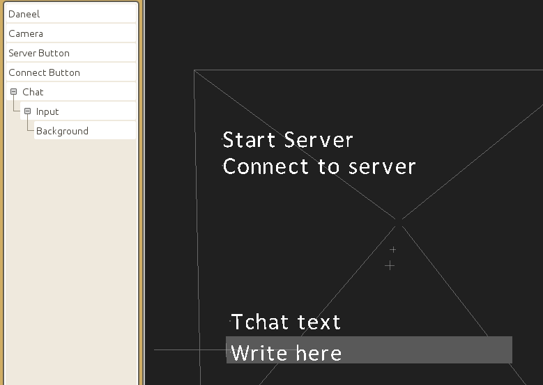

# How to create an in-game chat with CraftStudio and Daneel

It's always cool to be able to chat with fellow players while playing a multiplayer game.  
This tutorial will guide you through the creation of such in-game chat with [CraftStudio](http://craftstud.io) and [Daneel](https://static.florentpoujol.fr/daneel).

In the course of this tutorial, you will also learn : 

- About Daneel's tags, events and dynamic getters and setters calls
- How to setup buttons with Daneel and the `Mouse Input` script
- How input fields works
- How to setup a basic server and connect to it

But first let's think about what we need :  
The chat will use CraftStudio's networking API, so we need a way to :

- create a server
- connect to the server
- store the player ids of the connected players
- one script to handle all that

Then for the chat itself, we need to be able to write in an input field as well as display text, plus the chat script itself.  

## Project setup 

[Download the tutorial's .cspack](/chat-tutorial.cspack)

Create a new project, select the `.cspack` in the `Import/Export` tab of the project's administration then import the four scripts `Daneel`, `Mouse Input`, `GUI/GUI` and `GUI/Input` as well as the `Calibri` font (you are free to use any other font).  

Setup the `LeftMouse` and `RightMouse` game controls.

Create two additional textual scripts : `Scene Manager` and `Chat`.

Create a scene.  
Add a game object named `Daneel` (for instance) then add both scripts `Daneel` and `Scene Manager` as a scripted behavior. Keep this game object at the top of the hierarchy.  
Add another `Camera` game object, add a `Camera` component and set it to `Orthographic` then add the `Mouse Input` script as a scripted behavior.

## Setting up the server

### Buttons

Add two more game objects named `Server Button` and `Connect Button`, add a `TextRenderer` component on each one then set the `Start server` and `Connect to server` texts (respectively). Scale them down and/or increase the camera's orthographic scale so that they fit in the the camera's frustum.  

While you are in the scene, select the camera game object, update the `tags` property of the `Mouse Input` scripted behavior and write `button`.

Now opens the scene manager script, we will setup the buttons in the `Awake()` function.

What we want is to execute a function when the player left click while the mouse hovers the button's text renderer. Thanks to the `Mouse Input` script, this is very simple :

We have setup the `button` tag on the `Mouse Input` scripted behavior's property so that it will get all game objects who have this tag and check the position and actions of the mouse against them.  
You can [read more about Daneel's mouse inputs here](https://static.florentpoujol.fr/daneel/docs/mouse-input).

When the left mouse button will be clicked while the mouse pointer hovers a game object, the `Mouse Input` script will fire the `OnClick` event at it, which means that it will try to call an `OnClick` function on the game object.

All we have to do for each game object is :

- get the game object (you can use either `CS.FindGameObject()` or `GameObject.Get()`)
- add the `button` tag to it (use `gameObject:AddTag()`)
- setup the `OnClick` function

Here is the code so far : 

    function Behavior:Awake()
        local serverButton = GameObject.Get("Server Button")
        serverButton:AddTag("button")
        serverButton.OnClick = function()
            print("server button is clicked")
        end
        
        local connectButton = GameObject.Get("Connect Button")
        connectButton:AddTag("button")
        connectButton.OnClick = function()
           print("connect button is clicked") 
        end
    end

You can now launch the game and click on both texts to see the debug lines being printed in the `Runtime Report` tab.

The server button is used to start a server. You can [read on the wiki](http://learn.craftstud.io/Reference/Scripting/CraftStudio.Network) that starting a server is done by calling `CS.Network.Server.Start()`.  
We will also give some feedback to the user by changing the text of the button to `"Server started"`.

    serverButton.OnClick = function()
        CS.Network.Server.Start()
        serverButton.textRenderer.text = "Server started"
    end
    
The line `serverButton.textRenderer.text = "Server started"` is actually exactly the same as `serverButton.textRenderer:SetText( "Server started" )`.  
This is one of Daneel's feature to allow to [dynamically call getters and setters](https://static.florentpoujol.fr/daneel/docs/features#dynamic-functions), as if they were just properties.

And you can do this for game objects and all components :

    local parentGO = gameObject.parent
    -- is the same as
    local parentGO = gameObject:GetParent()

    gameObject.transform.localPosition = position
    -- is the same as
    gameObject.transform:SetLocalPosition( position )

Launch the game now, the text of the button should change whenever you click on it with the mouse.

The connect button is used to connect to the server we just started. This time we will call `CS.Network.Connect()` with three parameters :

- The local IP `"127.0.0.1"` since you connect to the server you just created on your computer (in the case of this tutorial).
- The default port `CS.Network.DefaultPort`
- A function that will run if we successfully connected to the server. Once again we will give some feedback by changing the button's text to `"Connected"` from this function.

    connectButton.OnClick = function()
        CS.Network.Connect( "127.0.0.1", CS.Network.DefaultPort, function()
            connectButton.textRenderer.text = "Connected"
        end )
    end

Once again, the button's text should change to "Connected" after you clicked on it (and after you started the server).

### List of player ids

The last thing we need to setup is the list of the ids of the players connected to the server.  
Such list will be required later when the server will send a chat message to all players.

If you [read the network page on CS's wiki](http://learn.craftstud.io/Reference/Scripting/CraftStudio.Network), you must know that when a player just connected to or disconnected from the server, two functions are called.  
These are the functions you set as the only parameter of `CS.Network.Server.OnPlayerJoined()` and `CS.Network.Server.OnPlayerLeft()`.

    function Behavior:Awake()
        ...
    end

    PlayerIds = {}

    CS.Network.Server.OnPlayerJoined( 
        function()
            print("a player joined")
        end
    )

    CS.Network.Server.OnPlayerLeft( 
        function()
            print("a player left")
        end
    )

You can launch the game, start the server then connect to it and observe `"a player joined"` being printed in the runtime report.  
Now launch the game a second time while the first game's window is still opened then connect to the server (don't try to start another server, it won't work).  
You will see `"a player joined"` being printed another time. Finally, close this second window to see `"a player left"` being printed.

The functions set in `OnPlayerJoined` and `OnPlayerLeft` receive one argument each : the player object and the player id, respectively.  
We will add or remove the player ids to/from the `PlayerIds` table from these functions :

    PlayerIds = {}

    CS.Network.Server.OnPlayerJoined( 
        function( player )
            table.insert( PlayerIds, player.id )
        end
    )

    CS.Network.Server.OnPlayerLeft( 
        function( playerId )
            table.removevalue( PlayerIds, playerId )
        end
    )

`table.removevalue()` is one of the functions introduced by Daneel that extends Lua's built-in libraries.

## Chat

Now off to code the actual chat system !

### Scene setup

Go back in the scene, add a `Chat` game object, then a text renderer and a network sync component, as well as the `Chat` script as a scripted behavior.

Add an `Input` game object as a child of the previous one, then add a text renderer and the `GUI/Input` script as a scripted behavior.  
Select the camera and add the `guiComponent` tag to the tags `tags` property of the `Mouse Input` scripted behavior. As there is already a tag in the field add a coma between the two (the field should now contains something like `button,guiComponent`).

Add a `Background` game object as a child of `Input`, then add a model renderer component (and create a model for it).

Here how it should looks :

Select the `Input` game object then just set `"Write here"` (or whatever else you want) as the input's `defaultValue` property.  
Finally, add a `ValidateInput` game control and map it to the `Enter` key.

Launch the game and click on the input field. The default text disappear and you can write in it.  
Click anywhere else and you can no longer write in the field because it has been unfocused. If the field was empty, the default text is put back in.  
The background also focus the input field when it is clicked.

That all we need for the scene, let's code !

### How input fields works

One way to do it would be to define a game controls for every keys of the keyboard, then have a code like :

    function Behavior:Update()
        if CS.Input.WasButtonJustPressed( "A" ) then
            self.inputText = self.inputText .. "A"
        elseif CS.Input.WasButtonJustPressed( "B" ) then
            self.inputText = self.inputText .. "B"
        ...
    end

This is obviously the worst solution because it's horribly tedious to setup.

Thankfully, you can catch the fact that the player press any keys on its keyboard by passing a function to `CS.Input.OnTextEntered()`.  
The function receive the character the player want to write (supports capitalization and keys with multiple characters), plus some special character for keys like Enter or Backspace.

    CS.Input.OnTextEntered( function( char )
        local charNumber = string.byte( char )

        if charNumber == 8 then -- Backspace
            -- remove character form input's text
        elseif charNumber == 13 then -- Enter
            -- validate field, maybe

        -- Any character between 32 and 127 is regular printable ASCII
        elseif charNumber >= 32 and charNumber <= 127 then
            -- add character to input's text
            -- self.inputText = self.inputText .. char
        end
    end )

For instance, here is the function used by Daneel's `GUI.Input` component :

    input.OnTextEntered = function( char )
        if input.isFocused then
            local charNumber = string.byte( char )

            if charNumber == 8 then -- Backspace
                local text = gameObject.textRenderer:GetText()
                input:Update( text:sub( 1, #text - 1 ), true )

            -- Any character between 32 and 127 is regular printable ASCII
            elseif charNumber >= 32 and charNumber <= 127 then
                if input.characterRange ~= nil and input.characterRange:find( char, 1, true ) == nil then
                    return
                end
                input:Update( char )
            end
        end
    end

You can also [check out how it's done in Blast Turtle](http://learn.craftstud.io/Tutorials/Blast_Turtles).

### NetworkSync setup

As said above, the chat system uses CS's networking features, that's why you added a network sync component to the chat game object.

The first thing we need is to setup the network sync with an id. [As explained in the wiki](http://learn.craftstud.io/Reference/Scripting/NetworkSync), you do that by calling `networkSync:Setup( id )`.

    function Behavior:Awake()
        self.gameObject.networkSync:Setup( 0 )
    end

Network sync components, as their name suggest are used to synchronize game objects over the network.
All game objects that have been __synchronized with the same network sync id__ will be able to send messages to each other over the network with functions like `networkSync:SendMessageToServer()` and `networkSync:SendMessageToPlayers()`.

### Chat code 

A player connected to the server can't send a message to every other connected players with `networkSync:SendMessageToPlayers()`, only the server can use this function.
But players can send messages to the server with `networkSync:SendMessageToServer()`.

How the chat works is simple : 

- the input field is validated
- we take the input's text and send it to the server
- the server receive the text from one player then broadcast it back to all players
- players receive text from the server and update the chat's text.

The chat script will mostly be composed of three simple functions `SendTextToServer()`, `BroadcastText()` and `ReceiveText()`.

But first we need another one to get the input's text when the field is validated, when the player press the `ValidateInput` control.
When that happens, the `OnValidate` event is fired at the input component.

We will catch this event exactly as we did for the `OnClick` event.

    function Behavior:Start()
        -- Remember this script is on the "Chat" game object
        -- This code is in Start() to wait for the input component to be created
        
        -- The input component is on the Input game object which is in our case a child of "Chat"
        self.input = self.gameObject:GetChild("Input").input
        
        -- When the player press the "ValidateInput" button (Enter key) to send the text he wrote, 
        -- the OnValidate event is fired at the input
        
        self.input.OnValidate = function( input ) -- the object events are fired at are always passed as the event's first argument
            -- Take the input's text and make sure it is not empty
            -- string.trim() remove the trailing whitespace.
            local text = input.gameObject.textRenderer.text:trim() 

            if text ~= "" then
                self:SendTextToServer( text )
            end

            -- empty the input's text
            input.gameObject.textRenderer.text = ""
        end
    end

    function Behavior:SendTextToServer( text )
        print(text)
    end

If you try this code now, the text you write in the input field should be written in the runtime report whenever you press the `Enter` key.

Now, to actually send the text to the server, just use `networkSync:SendMessageToServer()`

    function Behavior:SendTextToServer( text )
        self.gameObject.networkSync:SendMessageToServer( "BroadcastText", { text = text } )
        -- data sent to or receive from the network is always a table, you can't directly send some string or number for instance
    end

    function Behavior:BroadcastText( data, playerId )
        self.gameObject.networkSync:SendMessageToPlayers( "ReceiveText", data, PlayerIds )
    end
    CS.Network.RegisterMessageHandler( Behavior.BroadcastText, CS.Network.MessageSide.Server )

    function Behavior:ReceiveText( data )
        self.gameObject.textRenderer.text = data.text
    end
    CS.Network.RegisterMessageHandler( Behavior.ReceiveText, CS.Network.MessageSide.Players )

`BroadcastText()` and `ReceiveText()` are __message handlers__, functions that can be called over the network with `networkSync:SendMessageTo*()`.  
You need to register them with `CS.Network.RegisterMessageHandler()`, passing the function itself as well as the message side as argument.  
The message side tells if the function is considered as being part of the server `CS.Network.MessageSide.Server` (can be called by `networkSync:SendMessageToServer()`) or a player `CS.Network.MessageSide.Players` (can be called by `networkSync:SendMessageToPlayers()`).

Functions on the server side receive the data sent as first argument as well as the player id (of the player who called the function) as second argument.  
Functions on the player side only receive the data.

As you can see, `BroadcastText()` doesn't do much apart from passing the data along to all players via `ReceiveText()`.  
The third argument of `networkSync:SendMessageToPlayers()` is the list of player ids to which send the data. In our case, we use the `PlayerIds` table we set earlier.

And that's it. We now have a working in-game chat.  
Launch two game instances (two windows), create a server from one of them then connect to the server from both games and great each other via the chat !

## Going further

This code is very basic, it can be improved in many ways like 

- display the player id in front of the message to know who speaks
- display a message when a player connect or disconnect.
- give more feedback on the input's focused state
- focus/unfocus the input with keystrokes instead of the mouse

Here is below the full code with some improvements.

Chat :

    Chat = nil

    function Behavior:Awake()
        Chat = self
        self.gameObject.networkSync:Setup( 0 )
    end

    function Behavior:Start()
        -- This code is in Start() to wait for the input component to be created
        
        -- The input component is on the Input game object which is in our case a child of "Chat"
        self.input = self.gameObject:GetChild("Input").input
        
        -- When the player press the "ValidateInput" button (Enter key) to send the text he wrote, 
        -- the OnValidate event is fired at the input
        self.input.OnValidate = function( input )      
            -- Take the input's text and make sure it is not empty
                -- string.trim() remove the trailing whitespace.
            local text = input.gameObject.textRenderer.text:trim()
            if text ~= "" then
                self:SendTextToServer( text )
            end
            
            -- empty the input's text
            input.gameObject.textRenderer.text = ""
        end
        
        -- The OnFocus event is fired at the input when it gain or loose focus
        -- Change the background opacity to give a visual feedback on the input's focused state.
        self.input.OnFocus = function( input )      
            if input.isFocused then
                -- input.backgroundGO is the game object named "Background" as the child of the input's game object
                input.backgroundGO.modelRenderer.opacity = 0.3
            else
                input.backgroundGO.modelRenderer.opacity = 1        
            end
        end
    end

    function Behavior:Update()
        -- focus input when player press the C key
        if CS.Input.WasButtonJustPressed( "ChatFocus" ) then
            self.input:Focus(true)
        end
        
        -- unfocus when player press the Escape key
        if CS.Input.WasButtonJustPressed( "Escape" ) then
            self.input:Focus(false)
        end
    end

    -- Send a new piece of text over the network
    function Behavior:SendTextToServer( text )
        if IsConnected then
            self.gameObject.networkSync:SendMessageToServer( "BroadcastText", { text = text } )
        else -- client offline
            self.gameObject.textRenderer.text = text
        end
    end

    -- Called by a client to broadcast the text to all clients
    -- "data.text" is the text
    function Behavior:BroadcastText( data, playerId )
        -- send the playerId along the text so that ReceiveText() can display it with the message
        data.senderId = playerId
        self.gameObject.networkSync:SendMessageToPlayers( "ReceiveText", data, PlayerIds )
    end
    CS.Network.RegisterMessageHandler( Behavior.BroadcastText, CS.Network.MessageSide.Server )

    -- Called by the server on all clients
    -- Updates the chat's text renderer with the new text
    function Behavior:ReceiveText( data )  
        local playerName = ""
        if data.senderId ~= nil then
            playerName = "[Player "..data.senderId.."] "
        end
        
        self.gameObject.textRenderer.text = playerName..data.text
    end
    CS.Network.RegisterMessageHandler( Behavior.ReceiveText, CS.Network.MessageSide.Players )

Scene manager : 

    IsConnected = false

    function Behavior:Awake()
        local serverButton = GameObject.Get("Server Button")
        serverButton:AddTag("button")
        serverButton.OnClick = function()
            CS.Network.Server.Start()
            serverButton.textRenderer.text = "Server Started"
        end
        
        local connectButton = GameObject.Get("Connect Button")
        connectButton:AddTag("button")
        connectButton.OnClick = function()
            connectButton.textRenderer.text = "Connecting..."
            CS.Network.Connect( "127.0.0.1", CS.Network.DefaultPort, function()
                connectButton.textRenderer.text = "Connected"
                IsConnected = true
            end )
        end
        
        
        -- This function is called on a client when it is disconnected from a server.
        CS.Network.OnDisconnected( function()
            Chat.gameObject.textRenderer.text = "You have been disconnected"
            connectButton.textRenderer.text = "Connect to server"
            IsConnected = false
        end )
    end

    -- List (array) of connected player ids
    PlayerIds = {}

    CS.Network.Server.OnPlayerJoined( 
        function( player )
            table.insert( PlayerIds, player.id )

            -- You can call Chat:BroadcastText() directly because the function passed to CS.Network.Server.OnPlayerJoined() is only called on the server
            Chat:BroadcastText( { text = "Player "..player.id.." connected" } )
        end
    )

    CS.Network.Server.OnPlayerLeft( 
        function( playerId )
            table.removevalue( PlayerIds, playerId )
            Chat:BroadcastText( { text = "Player "..playerId.." disconnected" } )
        end
    )

