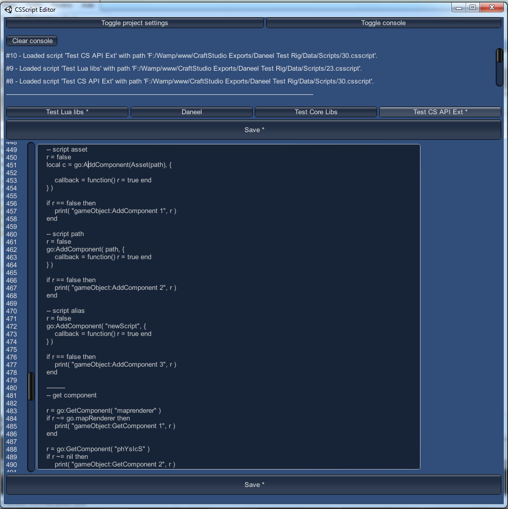
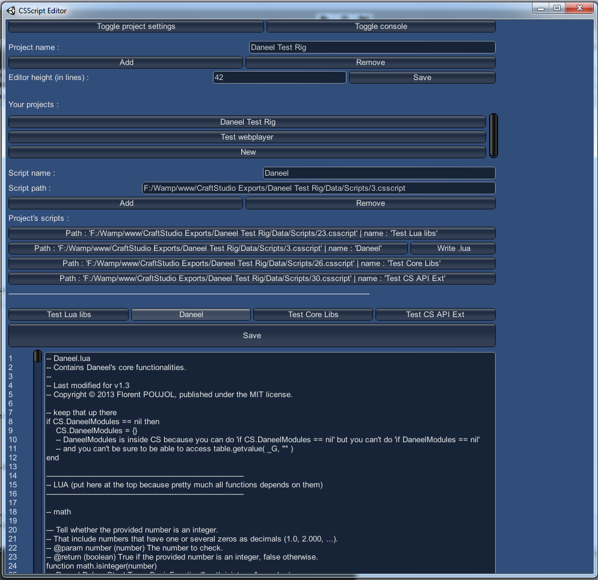

# CSScript Editor

This application allows you to edit `.cscript` files (including public properties) outside [CraftStudio](http://craftstud.io).

This is usefull for web player debugging for instance.  
Note that you can't read scripts inside projects that are open in a CraftStudio server (you need to stop the server).  
The projects and scripts data are saved in an `EditorData.txt` file in the application's root folder.  
Due to Unity's native GUI limitations you can't browse script under the line 3500.

## Download

Check the `build` folder.

## Public properties

The scripts's public properties (if any) are found at the top of the script and follow this pattern :

    --[[PublicProperties
    name type defaultValue
    /PublicProperties]]

- The name, type and defaultValue must be separated by at least one space and must exist on the same line.
- The type may be `boolean`, `number` or `string`.
- When the property is of type `string`, its value must be enclosed in double quotation marks (`"`).
- You may delete, move or modify any existing properties or add new properties.

Ie :

    --[[PublicProperties
    isAlive boolean true
    health  number  52.8
    name string "John"
    /PublicProperties]]

