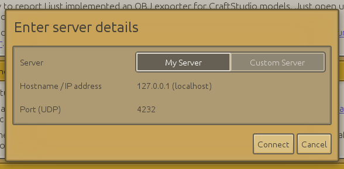
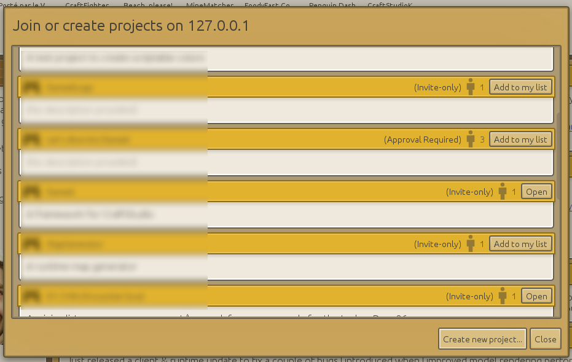
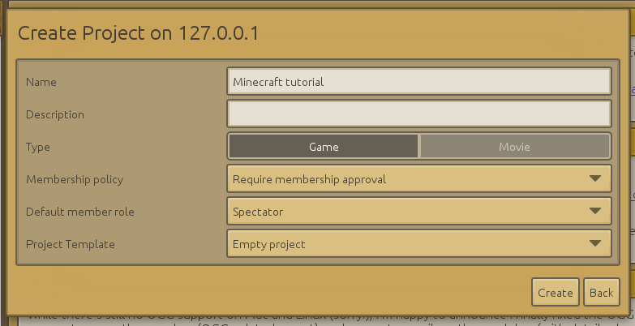
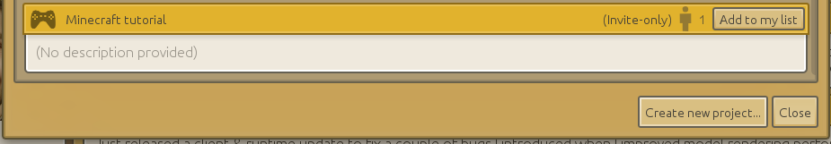

[< Tutorial introduction](tutorial-introduction.md)

[Introduction to Models and Animations >](introduction-to-models-and-animations.md)

---

# Introduction to CraftStudio

In this chapter, you will learn more about the CraftStudio ecosystem, how to install the editor and create a project.  
From now on "CraftStudio" is abbreviated "CS" throughout the tutorial.

- [Brief history of CraftStudio](#history)
- [CraftStudio's Community](#community)
- [Installing CraftStudio](#install)
- [First steps in the editor (client)](#first-step)
- [Creating a project](#create-project)

## Brief history of CraftStudio

After a few years as a programmer in the game industry, Elisée Maurer started the development of CraftStudio in fall 2011 with one goal in mind : making game development as simple, fun and social as possible.

First video on [CraftStudio's channel](http://www.youtube.com/user/craftstudiodev) : https://www.youtube.com/watch?v=KA_AhtkmRYQ

A crowdfunding campaign [was successfully run on Indiegogo](http://www.indiegogo.com/projects/craftstudio-real-time-collaborative-game-making) in March 2012, raising more than 23000$ yet at that time only a windows-only, pre-alpha version was working with no real possibilities to create games since you coulnd't create scripts yet.  

https://www.youtube.com/watch?v=BFVsgFsLzdQ

In November 2012, CraftStudio was showcased at this year's MineCon in Paris (Minecraft convention). [MineMatcher](http://play.craftstud.io/games/MineMatcher), and CraftFighter (trailer below) were both created by members of the community for the occasion.

https://www.youtube.com/watch?v=TjpW-K70WwM

The CraftStudio's Beta came out in March 2013 with major new features.  
CraftStudio is since then still in beta but regularly benefits from new features and fixes.

## CraftStudio's community

This tutorial is obviously not the only resource where you can look for information and help.

**[The official wiki](http://learn.craftstud.io)** contains several tutorials as well the obligatory [scripting reference](http://learn.craftstud.io/Reference/Scripting). You might want to bookmark it, as there are chances that you will consult it rather frequently.  
If you are not confident reading the wiki in English, you should know that it may have been translated to some extends by members of the community (you can change the language at the bottom of the page).

[Don't neglect the old wiki](http://craftstudio.wikia.com/wiki/CraftStudio_Wiki) which still contains a lot of great resources.

If you have particular questions that are not answered by the wiki or this tutorial, **[the forum](http://www.craftstudioforums.net/index.php?forum/)** is the next best place to look for answers.

If you are interested in the development of CraftStudio, you may be interested to [follow @CraftSudioDev on Twitter](https://twitter.com/craftstudiodev).

## Installing CraftStudio

### A little terminology first

Before we begin, it's important that we all know exactly what we are talking about :

The **Launcher** is where you log-in with your account and it automatically checks and download updates for any of the CraftStudio components.

The Client (that I call the **Editor**) is the software that you use to create all the assets and the games. It is launched by the launcher when it has finished updating but you can also open it directly.

The **Server** is what hosts the projects that you create with the editor. By default, a local server is launched at the same time as the client so you can just create projects locally on your computer, but the server can be remote.

The **Server Manager** is used to configure, start and stop the server.

The **Runtimes** are the *game engines*, they are what makes your games runs. There is one per platform (Windows, Mac, Linux and Web).

The **Projects** are the games or movies that you edit via the editor. They are always hosted on a server.

The **Assets** are the game's components. It's what you create and assemble in a project. They are the Models, Animations, Maps, TileSets, Scenes, Scripts, Sounds, Fonts and Documents.

### Free vs Premium

CraftStudio comes with a free or a paid premium license and you can upgrade from free to premium at any time very easily.

The free license let's you create any number of projects and any kind of assets (except scripts).  
But you can't create script assets, you can't export or import assets from/to your projects and you can't export your game.  
The "only thing" the license allows you to do is create stuffs, not testing themIt still gives you hours of fun and creation but you will quickly be pretty limited with the free license if you want to practice for real while following this tutorial.

The premium (or full) license let's you do anything including creating scripts, exporting/importing assets from/to your projects and especially exporting your game.  
It can be purchased for 20 euros (while in Beta) on CraftStudio's website.

### Download and install

First [create an account on CraftStudio's website](http://craftstud.io/login). This account is mostly used to log in CraftStudio, so be wise with the name you choose.

Then [download](http://craftstud.io/download) or [purchase](http://craftstud.io/purchase).

Proceed to the installation like with any other software. Note that the location you can choose only apply for the Launcher. The editor, server and runtimes are always installed in the same directory (`C:\Users\ [your user name]\AppData\Roaming\CraftStudio` on Windows).  

The icon that may have been created will open the launcher. Once logged in, you only need to open the launcher to update CraftStudio.  
If you [follow @CraftSudioDev on Twitter](https://twitter.com/craftstudiodev) or the #CraftStudio hashtag, you will know when an update is available.    
So if you want you can open the editor directly by pointing at (`C:\Users\ [your user name]\AppData\Roaming\CraftStudio\CraftStudioClient\CraftStudioClient.exe` on Windows).

## First steps in the editor (client)

### Breakdown of the interface

")

#### Left column

First look at the left column. At the top, you have a row of buttons `Home` (currently selected), `Store`, `Community Projects` and `Help & Resources`.

Below you have the projects list with always one project that you can't remove: the Community Hub.  
We will see below how to add projects to the list. 

Below the projects list you will find your friends list. Being friend with other CraftStudio users just allows you to chat together through CraftStudio.

Below the is the `Settings` and `My Server` buttons. This last button opens the Server Manager which allows you to manage your local server.

Finally you will find at the bottom of the column the online status indicator (click to toggle online state), the number of online players (click to refresh) and the editor's version number (click to open the `About` window).  
You can perfectly use CraftStudio when you are offline, but you won't be able to chat with your friends and you won't be able to connect to servers which require authentication so you won't be able to access the projects on those servers.  

**If you have to use CraftStudio offline** (because you don't have Internet or because the ports used by the CS master server or other servers are blocked), you need to disable the authentication on your local server : click on the `My Server` button, go to the `Settings` tab then click on `Disabled`. Go back to the `Server Status` tab then stop the server and start it again.

You can change the projects list/friends list size by dragging the separation between the two. You will often be able to change a window's size by dragging a separation between it and another component of the interface.  
You can hide/display the left column by clicking just to the right of it (that's very useful on small screens).

#### Community Projects

Clicking on the orange tab at the top of the left column changes the main interface to display the community projects.  
This is basically the list of almost all projects hosted on live CS servers, including your local server.  
Only the project whose membership policy is `Invite-only` are not listed.

#### Help & Resources

This tab gathers a few links to tutorials an other resources on the wiki to help you get started with creating a game.

## Creating a project

Click on the `Add or create project...` button at the bottom of the project list.

  
Remember that CS projects are all hosted on a server and that a local server was installed with CS and is launched along the editor (and the server manager).

To create a project and/or add a project to your project list, you first need to connect to a server. That's what this windows allows you to do.  
Don't change anything as we want to connect to our own local server. Just click on the `Connect` button.

  
The window that opens lets you see the projects hosted on the server.  
As this is the first time you install CS, your window will be empty, so let's change that and create your first CS project !  
Click on `Create new project...`

  
This new window lets you create a new project on the server you are connected to.  
For now, just enter a name (you will be able to update it later on) and change the `Membership policy` to `Invite-only` (so that your project become private) then click on `Create`.

Projects have one of the three Membership policy :

- Open (public) : anyone con join without approval
- Approval required : anyone can ask to join the project, and be approved or disapproved by the project's administrator(s)
- Invite-only (private) : the project does shows up in the Community Projects, and is only visible in the server's projects list if you are an administrator on this server.

  
Now you are back on the server's project list and your newly created project is now visible.  
As you can see the cartridge recap the project's name, description, membership policy, and number of members.  

Click on the button in the top-right corner that says `Add to my list` to add this project to your editor's projects list.  
Once you clicked the button the project is added in the project list, between the Community Hub project and the `Add or create project...` button.

You can move a project up/down in the editor's projects list by clicking and dragging its cartridge.  
You can also remove a project from the project list by clicking on the bin that appears when the mouse hovers the cartridge and the project is not opened in the editor. *Removing a project from the projects list does not remove or delete the project from the server.*

To open the project, you can either click again on the button in the server's window that now says `Open`, or click on the project's button in the project list.

---

[< Tutorial introduction](tutorial-introduction.md)

[Introduction to Models and Animations >](introduction-to-models-and-animations.md)
