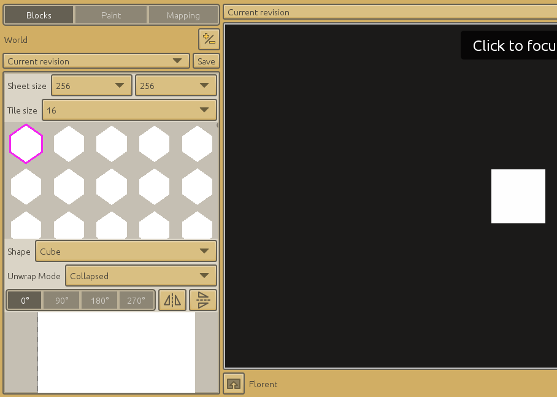
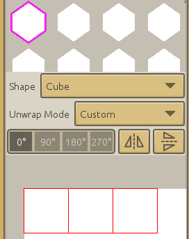
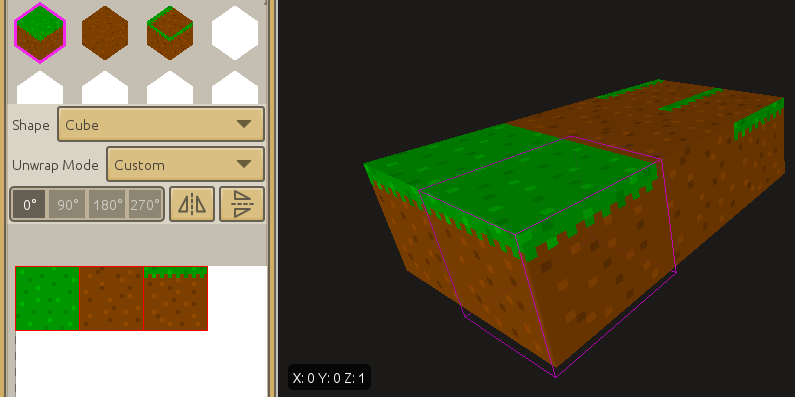
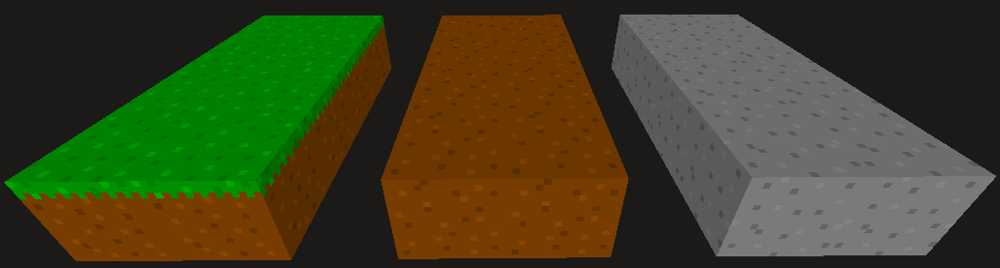
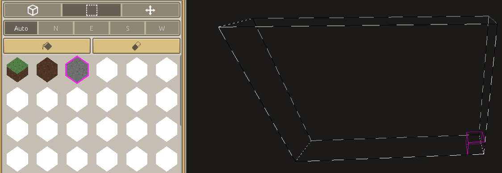
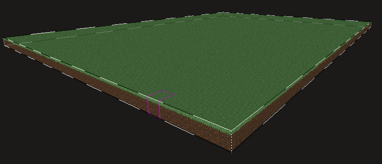

[< Introduction to Models and Animations](introduction-to-models-and-animations.md)

[Introduction to Scenes >](introduction-to-scenes.md)

---

# Introduction to Maps and TileSets

A character is great but it needs a world to evolve in.  
So lets create  one with two more assets : a Map and a TileSet.

A map is really like a Minecraft level : it is composed of blocks of different kinds. The map asset define which kind of block are where.  
The tile set define how those blocks looks, how they are shaped and textured.

In the project's home, go to the `Maps` tab and create a new map asset.

The new maps opens. If you look closely, the interface is not so different than the model's : there is a `Save` button, there is the chat, there is a black main window and a left column in which you can find familiar terms like `Sheet size` or `Unwrap mode`.  
Some of what you learned during the creation of Steve's model and animation will also be useful with maps and tile sets.

- [Building levels, Minecraft-style](#building)
- [Painting](#painting)
- [Mapping](#mapping)
- [Map block coordinates](#map-block-coordinates)
- [Conclusion](#conclusion)

## Building levels, Minecraft-style

First we need to create a new tile set : proceed exactly like for the animation. Click on the `+/-` button, then create the new tile set with the name you want and a tile size of 16.  
As for the model block, a tile size of 16 means that the map blocks texture will be 16 pixels wide (when they have the shape of a cube).  

> Map blocks with a tile size of 16 have the exact same size as models with a block size of 16 in all axis.

Here is how the interface should looks like now :

One white block has appeared in the map. 
If you focus the main window, a purple cube outline follows the mouse and outlines any cubes the mouse hovers.

Building a map will sounds familiar because it works pretty much like in Minecraft : left click and a block appears inside the purple outline, right click over a block and it disappear. Left click over a block and a new one appear just next to the face the mouse hovered.

This is how you place blocks one by one. Don't forget you can move in the main window with WASDQE/middle mouse.  
We will see later a way to fill whole areas but for now we will mostly work on the tile set.

### Setting up the TileSet

Be sure to be in the `Blocks` tab.  
The `Sheet size` is the texture size, you don't need to update it for now.  
As said, the `Tile size` is the same as the block's size. You can change it now to observe the blocks in the main window getting bigger or smaller.

The window below is the tile set's list of blocks (you can scroll up/down). A tile set is always composed of 255 blocks which ID range from 0 to 254.

The blocks are cube by default but you can select any of the shapes in the `Shape` drop-down list. The shape updates in the blocks list, in the main window and on the texture.  
Since we are building a Minecraft-like, cubes are fine.

## Painting

No surprise here, it's exactly the same principle as for models.  
You can change each block's `Unwrap mode` from the `Blocks` tab and paint them from the `Paint` tab.

For now we will paint three blocks : grass, dirt and stone.  
Stone and dirt are easy to do : it's the same grayish and brownish texture on all six faces of the cube.  
The dirt is a little different since the top face is greenish, the bottom has the same dirt texture and all side faces have the same dirt texture too but with some green at the top.

The first block with ID 0 will be our grass block. This block uses three different textures, so set the unwrap mode to custom.  
We need the top and bottom face to use their own space on the texture. The front, left, back and right faces share a third space.

Select the first block in the blocks list then set its unwrap mode to `Full`, then to `Custom` and dispatch the outlines as needed.

Before setting the other blocks unwraps, I suggest we paint these first so that we easily see which part of the texture is dedicated to which block.  

As for Steve's face, you can try to reproduce the block's texture with the paint tools or find the texture online and copy/paste it.  
Here is my take on Minecraft's texture :

You can see (back in the `Blocks` tab) that two other blocks (ID 1 and 2) already got a texture. That's just because we actually painted under their texture unwrap.

The next block to texture is the dirt block. And I have actually nothing to do because the second block's (with ID 1) unwraps are already over the dirt texture (which is also used for the bottom of the grass block). That's why I painted the texture there and put the bottom face of the grass block in the middle.

If it's not your case, all you have to do is select the second block, keep the unwrap mode to `Collapsed` and move the unwraps over the dirt texture.

Painting the stone block should just require you to select the block with ID 2, move the unwraps to a blank space and paint.

## Mapping

One last thing you have to learn to master map building in CraftStudio is how to rotate blocks and how to create or remove big chunks of blocks.  
Go to the `Mapping` tab.

### Block orientation

In addition to the block's texture and shape, you can set the block orientation among the four available : `North`, `East`, `South` and `West`.  
Click on one of the buttons with the initial of the orientation then lay the blocks in the main window as usual.

### Mapping area

Placing blocks one by one is simple and it works, but it's long even with a team effort (something that CraftStudio allow you to do, remember ?).  
To ease with this process, CS allows you to create an area that you can completely fill or empty at the push a single button.

Click on the button that looks like a dotted square (the same as for the selection tool in the `Paint` tab) then left click somewhere in the main window and drag with the mouse.

Now you can click on the buttons just above the blocks list to fill the area with the selected block or empty the area.

That's sweet, but it's actually kind of difficult to control the dimensions of the area with just the mouse.  
The best way to do it is to move (with WASDQE) while having the left mouse button down.

Try to create a big flat chunk : once you clicked the first time, move sideway and backward to widen the area.  
When you got one big enough, just fill it with the grass block.

## Map block coordinates

You may have noticed the little cartridge at the bottom-left of the main window.  
It displays the map coordinates of the currently outlined block.

Map coordinates will always be integers and do not depends on the tile size of the tile set.  
Keep in mind that there *may be* a difference between the map coordinates and the world coordinates (in the Scene asset) of the same block.  
The relation is as follow :

    world coordinates = map coordinates * (tile size / 16) * game object scale + game object position
    
And if the game object is rotated (its Euler angles are not {0,0,0}), you have to apply some more math to each components of the coordinates.  
The next tutorial explains what a Scene and a game object are.

## Conclusion

Maps are pretty simple to grasp : they are best used to create big static structures like landscape or buildings.  

The Map asset is basically a list of blocks while the Tile Set define how the blocks looks.

One of the great feature of maps is their capacity to be modified by script, at runtime (when the game is running).  
This is actually the feature that will be extensively used by the digging/building/random map mechanisms that made Minecraft so popular.

The next tutorial will introduce you the Scene asset, where all other assets are combined to create the actual 3D world you play in.

---

[< Introduction to Models and Animations](introduction-to-models-and-animations.md)

[Introduction to Scenes >](introduction-to-scenes.md)
