[< Introduction to CraftStudio](introduction-to-craftstudio.md)  

[Introduction to Maps and TileSets >](introduction-to-maps-and-tilesets.md)

---

# Introduction to Models and Animations

Enought chit-chat, let's start creating !  
In this tutorial, you will create the model, texture and walk animation of Steve, your avatar.

- [Create your first asset](#create-your-first-asset)
- [The interface](#interface)
- [Build : assemble the blocks](#build)
- [Paint : don't go over the edges](#paint)
- [Animate : get the blocks moving](#animate)
- [Conclusion](#conclusion)

## Create you first asset

By now you should have oppened your project and the interface should looks like this :

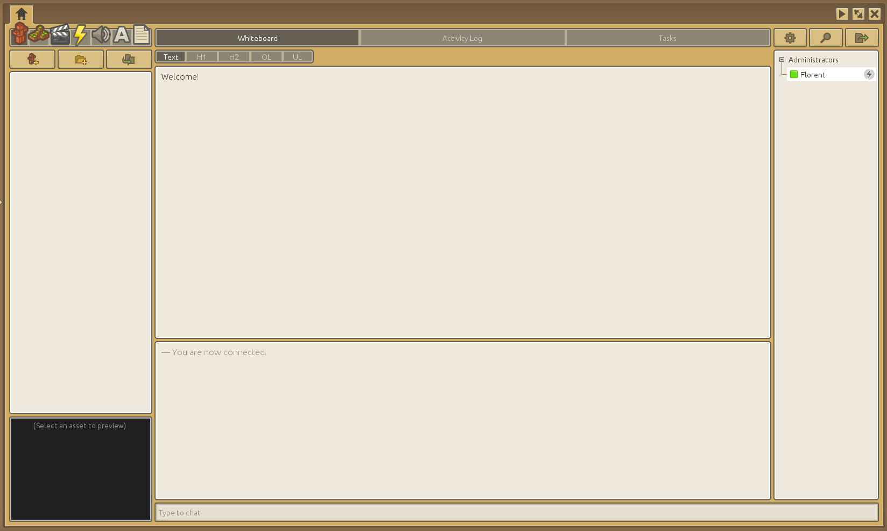

On the top left you have the assets icons, then three buttons to create an asset, create a folder and duplicate an asset just above the asset list which is for now empty.

The model pane is the first one and is already selected, so lets create your first model by clicking on the `Create model` button (the left one).

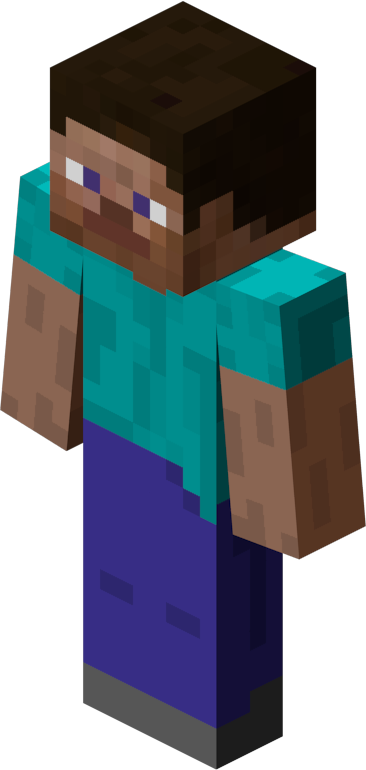

A new window opens an asks you to enter a name, just type `Steve`. Click on the `Create` button (or press `Enter`) and the new model opens right away.

Before we begin lets think about Steve and what it is made of.

As you can see in the image on the left (click on it to view full size), Steve is a very simple model because it is composed of six blocks : one head, one trunk, two arms and two legs.  
The blocks themselves are very simple since the head is a cude, each arm and leg have the same size and are just elongated rectangular parallelepiped ("3D rectangles"), and the trunk is like an arm but twice as wide.  

## The Interface

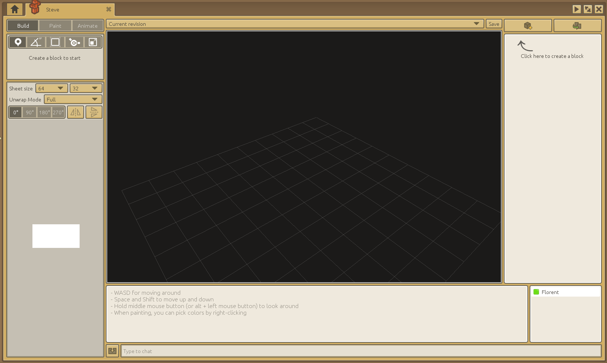

On the right, you have the list of blocks (models are only composed of blocks) and the two buttons to create and duplicate a block.  

In the middle you have the main window, it's in here that you will see the model and do some manipulations on the blocks.  

Below you can find the chat and to the right, the list of people that have the model opened (with whom you can discuss via the chat). *Remember that one of the main feature of CraftStudio is the multiplayer aspect, you can built any asset with several other people at the same time.*

On the left, you will find the `Build`, `Paint` and `Animate` tabs which are the three tasks needed to build a model.

## Build : assemble the blocks

In CS, a model is only composed of blocks, which are always cuboid (rectangular parallelepiped). This limits how your model will look (in comparison with a model created in Blender or 3ds Max for instance) but cuboids are really simple to use, so that's great for newcomers (as well as anyone that is not a 3D modeler...).

Create your first block by clicking on the `Create block` button then give him the name `Trunk` in the window that opens (like for assets) as this block will be Steve's trunk.

Now a white rectangle as appeared in the main window, you can turn around it by having the mouse in the main window and moving it while pressing the mouse wheel (or `Left Alt` + `Left Mouse` buttons).  
The chat window also gives you instructions on how to move around the model's window.

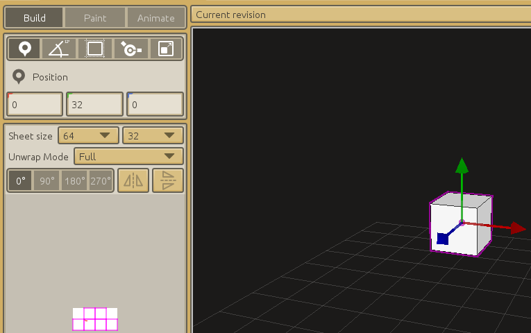

If you click anywhere in the main window, it will deselect the block. To select it again, click on it in the main window or in the blocks list.  

Now as you can see in the left panel, the position of the block is `0` on the `x` axis, `32` on the `y` axis and `0` on the `z` axis. New blocks will often be created at this position.  
We, however want the block to be at a position of `0, 0, 0`, so we need to lower it on the `y` axis.

To do that, you can either update the value of the position directly in the field in the left panel (click inside the field then write `0` instead of `32`) or you can drag the cube down in the main window by clicking (and holding) on the green arrow then moving the mouse down until the green field (the middle one) displays `0`.

It's the same principle to change the position on the other axis, as well as to change the other block's components (the rotation, size, pivot offset and scale).  
Try different things to get used to it.

Now we need to give the block the proper size.  
Click on the image of Steve above to view it at full size, then count the number of pixels on each block. Remember that the legs and arms have the same size and that the trunk is just twice as wide as an arm.

- the head is 8x8x8 pixels
- an arm or leg is 4x4x12 pixels
- so the trunk is 8x4x12 pixels (8x12 for the front and back faces)

It was important to count the pixels because in CS, the size of the model's blocks are expressed in `texture pixels`, or how much pixels they will take on the model's texture.

In the left pane, click on the middle button, the one that says `Block size (C)`.  
You can see that the values in the fields and the handles have changed.  

The default block size is always `16, 16, 16`. Now just update the values.  
Depending which one you put is each field, the block may actually not look like what you want :
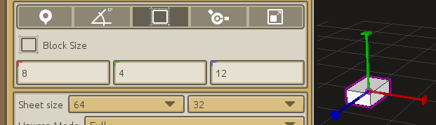

So lets correct the values :  
The height of the trunk is 12 pixels and the height is always the `y` component (the green one), so write 12 in the middle field.  
The width of the trunk is 8 pixels so you need here to update the `x` component (the red one), while the thickness is determined by the `z` component (the one that measure 4 pixels).

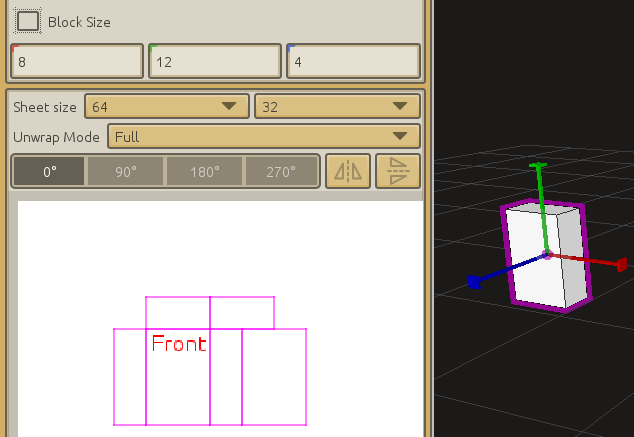

You may also have noticed that the purple lines that you can see on the white rectangle in the left panel have changed when you updated the block's size. We will see what they mean when we will texture the model.

OK, we have one block ! Five to go !

Do the head first, it's a cube that measure 8 pixels on all axis.  
Create a new block, name it `Head`, then update its size before moving it.  

Now we have to move the head over the trunk.  
If you had the trunk block selected when you created the head, **the head is now a child of the trunk**. It looks like this in the blocks list :

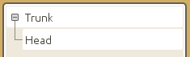

Otherwise, it looks like this :

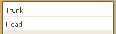

The difference is important because the position and rotation of child blocks are **relative** to their parent's, instead of being absolute (which is the same as being relative to the model's origin).  
That will impact the position's and rotation's values displayed in the fields and most of all, all children of a block will move at the same time as their parent when its position or rotation is modified.

You can try it yourself, but first be sure that the head is a child of the trunk. If it's not the case already, just drap-and-drop the head's cartridge in the blocks list over the trunk's cartridge (do the opposite to de-parent).  
Then select the trunk and move it, you will see that the head is also moving !

The other advantage to parent the head to the trunk is that it make the positioning of the head very easy.  
First move the head at `0, 0, 0`. The head is now "inside" the trunk, both blocks centers are at the same position. All you have left to do is move the head up by `10` units (remember that the height, or moving up or down means working on the green axis).

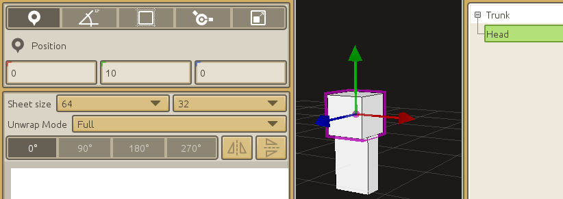

And four blocks to go !  

Create a new block, name it `Left Arm`, parent it to the trunk, change its size (as we have seen, the height is 12 pixels), move it to `0,0,0`, then move it sideway so that the arm block appears to the left of the trunk.

> But which side is the left of the model ? 

That's a very good question, thanks for asking !

The answer is simple to remember : the red arrow points to the left (toward the positive `x`), the green arrow points to the top (toward the positive `y`) and the blue arrow point to the front (toward the positive `z`).  
If you didn't moved to much with the camera, there is a chance that you face the front of the model, so you have to put the arm's block to the right of the trunk (the correct position is `6,0,0`).

Do the same for the other arm and both legs.

But wait !  
There is better way to do that than doing all the process over again. You can just **duplicate** the left arm. The new block will be created with all the same characteristics already.

While having the left arm block selected, click the `Duplicate Model Block` button (at the top-right of the blocks list) and name the new block `Right Arm`.  
The new block looks exactly like the left arm, is already parented to the trunk and is at the same position, so all you have to do is push the right arm to the right of the trunk.

Do the same for both legs and *voilà*, you have created your first model with CraftStudio !

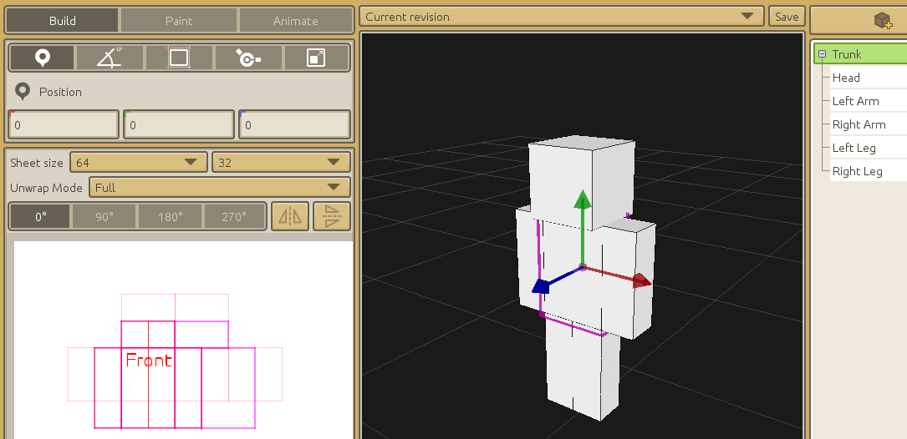

Well, actually all we have for now is a hierarchy of motionless white blocks...

We still have to texture the blocks and animate them, so lets get to it !

--- 

> Stop ! Isn't it wise to save before going further ?

Absolutely ! But don't fear because it's already saved.  
Actually it saves all the time. Because of the multilayer aspect, all modifications are saved automatically and broadcasted to all players that have the asset opened.  
That's great, right ?

Yes, but you may have noticed that you can't undo what you did, the `Ctrl+Z` shortcut has no effect !

Thankfully, assets have a system of **revision** (a save of the asset). What's interesting is that you can replace the current version of your asset by restoring an old revision. This is the only way to undo something. 

Create a revision by clicking the `Save` button (above the main window) (or `Ctrl+S`). Update the revision's name if you want.  
You can click on the revision dropdown list (just next to the save button) to browse all revisions of this asset and click on one revision to visualize it.  
Click on the `Restore` button to restore your asset to this revision.

A good practice is to create a revision after each important task you complete so that you don't loose to much if you have to undo something.

## Paint : don't go over the edges

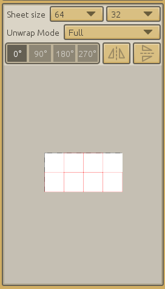

Before we head over to the `Paint` tab and begin to lay colors on Steve, you have some theory to learn.  
So for now, create a new model, and just add a single block.  

The left-bottom panel should looks like the image. Before we paint the blocks faces on the texture we must give the correct size to the texture, depending on the layout you give the all the block's faces.

Enlarge the panel by clicking and dragging the separation between it and the main window, then zoom with the mouse wheel while the mouse is over the texture.

The `Sheet size` is the texture's size (the white area). You may increase it up to 2048x2048 pixels but in our case, it's not needed.  
Now look at the texture. Depending if you have the block selected, you may see purple or red lines and maybe `Front` in red inside one of the face.  

The lines are the cube's unwrap, it outlines the cube's faces. It's by painting inside each square that you will paint each face of each block.  
You can click inside each face and CS displays which face it is. 

If you click and drag, you can also move the unwraps on the texture. And by playing with the row of buttons, you can change the unwraps direction and orientation. 

The six faces are outlines because the `Unwrap Mode` is set to `Full`.  
Set the mode to `Collapsed` in order to have all unwrap on top of each other, each faces will share the same looks.  
The last unwrap mode is `Custom`, it allows to move each face's unwrap individually.

Now, go back to Steve's model. The texture is a little mess because the unwraps of all the blocks are on top of each other.  
Separate them by clicking on each block (in the main window or the block's list) then by moving the unwrap (click and drag). We will just give the same texture to each arms and each leg, so you may put the unwrap for each arm and leg at the same position.  
When you have finished, you should have a texture that looks like this :

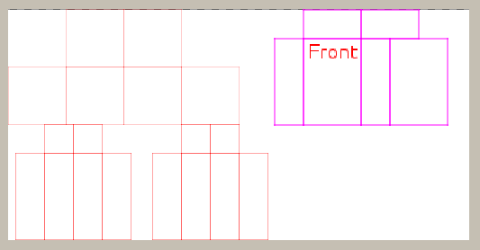

And as you can see, the unwrap's shape and size match the block's size.

That's esnough for the `Build` tab, go to the `Paint` tab.

The panel changed, you now have four buttons that we will call `Paint`, `Erase`, `Select` and `Move`.  
Below you have the `Select color` button and the brush size's slider.  

Below, the texture and the unwraps are still there but a little square now follows the mouse pointer, this is the brush.  

Click on the `Erase` button and left click on the texture. Some white pixels now become a gray checked pattern because the texture is removed.  
If you do that on a face, you will see (in the main window) that this face become transparent where you removed the texture.  

The `Select` tool allows you to select part of the texture then copy/paste and/or move the selected part with the `Move` tool.  

Steve is nor white nor transparent so we have to put some color inside the unwraps. Start by selecting a color with the `Select color` button or by right-clicking on the texture then change the brush's size with the slider or `Ctrl + MouseWheel`.

Apply the desired colors to the desired blocks, observe how it looks in the main window.  
Try to reproduce Steve's look, or be creative.

Here is what I end up with after a couple of minutes :

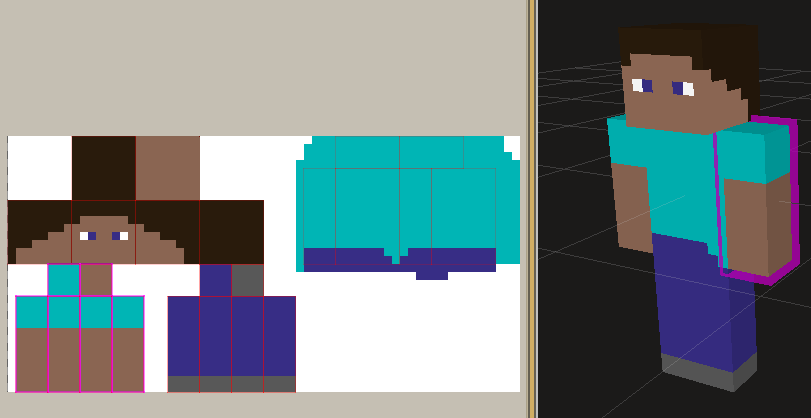

Not bad ! But we will improve the face and reproduce exactly Steve's face not by using the paint tool but by copy/pasting the whole face from an external image.

[We will use this image](imgs/intro-models-animations/steve-face.png) but it is to big. Steve face measure 8x8 pixels while the image is 300x300 pixels.  

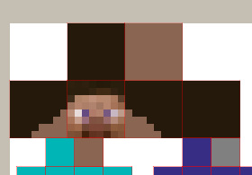

All we need to do is open the image in an image editing software (Paint, Paint.net, Photoshop, Inkscape, ...) and resize the image to 8x8 pixels.  
Once this is done, copy the image, return to CraftStudio, right-click over the texture (in the `Paint` tab) and paste the image with `Ctrl+V`.

The face as appeared over the texture with a white and black border. The `Move` tool is also now selected. Move the face over the correct unwrap then left click outside the face to apply it.

There you go ! We now have a nice model with a nice texture.  
Lets get him a nice animation, too !

## Animate : get the blocks moving

Animations are the second type of asset we works with. They are not part of the model but are used by one or more models.

They are used to move blocks over time so that the model appear to function or do something. We will create Steve's walk animation.  
As for the block structure and the texture, the walk animation is pretty simple : 

The only difference with the image is that the arms and legs are kept straight (they don't fold on the knee/elbow) and that the upper body don't tilt sideway.

Save your model then go to the `Animate` tab.  

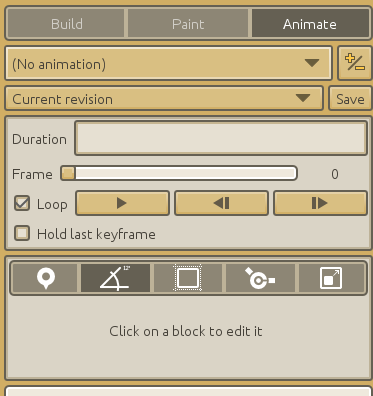

First we need to create a new animation asset then link it to this model.  
Click on the `+/-` button, the animations list opens. It is currently empty, so create a new one (as always, click on the button with a small `+`) and name it `Steve Walk`.

The checkbox on the left of the cartridge show that this animation is linked to this model, it now appears in the drop-down list on the right of the `+/-` button.

Animations being a separate asset, you can save them independently of models and yet they are not tied to a model, they are tied to a particular block hierarchy meaning that an animation will work with all models that have the same block hierarchy.

An animation last a certain time, expressed in frames (default is 30 frames which equals to 1 second).   
One way to create an animation would be to setup the position (and/or other characteristics) of a block for every frames, moving it a little every time, so that it appears to be moving while playing the animation. This is how cartoons were done, but this is also not practical at all.

What we will actually do is setup a few **keyframes** (frames that hold a key importance), which are the frames where a block will have a terminal state and we will let CS **interpolate** the block's state in-between those keyframes.

We will first animate an arm, then you will do the same for the other arm and the legs.  
All we have to do is setup two keyframes : one where the arm is completely backward at the beginning of the animation and one were the arm is completely forward in the middle of the animation. CS will interpolate the movement from back to front then from front to back.

Let the animation's duration at 30 frames, be sure that the `Frame` is on the first frame (completely to left, showing `0`).  
Now click on one of the arm. We will work on the arm's rotation, so click on the orientation tool in the left panel, then on the `Add Keyframe` button.

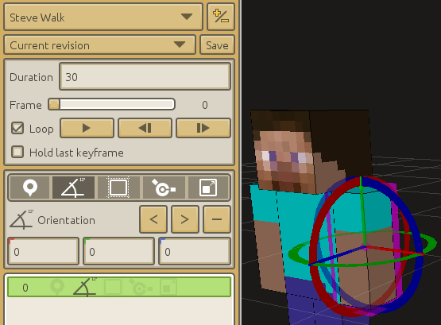

Handles have appeared on the arm, allowing us to change the arm orientation. As we want the arm to rotate forward/backward, we need it to rotate around the red axis. Click on he red wheel then mouse the mouse up/down.

And now you may have a situation...  
The rotation center is in the middle of the arm and not at the top where the shoulder should be !

This is something we have to fix first, you need to go back in the `Build` tab.  
We will just move the point considered as the center of the block (**the pivot**) by changing the block's `pivot offset`.

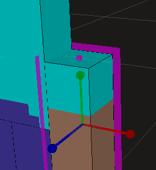

Select the left arm, then select the pivot offset tool (in the `Build` tab). Handles with a spherical end appears. They are centered on a pink sphere, this is the pivot.  
Use the handle to lower the block so that the pivot is now at the very top of the block and appears in the center of the block's top face.

Now select the position tool and move the block back up. Do the same for the other arm and the legs and go back in the `Animate` tab.

You see that the arm now rotates around its shoulder instead of its elbow.  
Rotate the arm backward up to 40° (or whatever you want) and we are done with this first keyframe.

Move the `Frame` slider to the 15th frame and while having the orientation tool selected, creates a new keyframe.

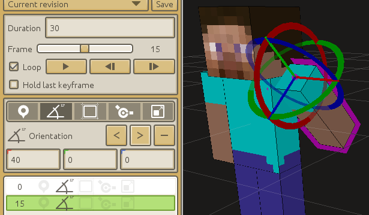

You can now rotate the arm again, rotate it at -40° for instance.  
And that's it, the animation of this arm is over.

You can move the `Frame` slider or click on the `Toggle Playback` button to observe the arm moving from back to front and then from front to back, as we wanted.

If you check the `Hold last keyframe` checkbox, you see that the arm moves from back to front, stops for half a second, then moves without animation to the back (and repeat).  
When this box isn't checked, the first keyframe is also considered as the last, so the block move back at its original state. Keep this box unchecked.

The animation of the other arm and legs follows the same principle and procedure. Just remember that they move in an inverted manner : when he left arm in front, the right one is in back, but the right leg in also in front while the left leg is in back).  
Also remember how to create a keyframe : move to the desired frame with the slider, select the desired tool, then create the keyframe. You may also have noticed that when a keyframe has been created, you can easily change its frame or remove it.

Several animations can be linked to the same model, you choose which one you edit via the drop-down list at the top of the panel.  

Which animation is played in-game is controlled by scripts. We will see how in a later chapter.

## Conclusion

3D models in CraftStudio are somewhat limited but it's what makes them really easy to build.  

Models are made of cuboid blocks that you can reposition, rotate, resize and stretch.

The texture determine how the blocks faces looks. Yet there is only very basic tools available to work on the texture, you can copy/paste from/to an external image/software.

Another asset, an Animation, can be used to easily animate blocks and give life to the model by setting up a handfull of keyframes and letting CraftStudio handle the rest.

The next tutorial will introduce you to two other assets that works together : the Map, used to created level geometry and the TileSet that controls how a map looks.

---

[< Introduction to CraftStudio](introduction-to-craftstudio.md)

[Introduction to Maps and TileSets >](introduction-to-maps-and-tilesets.md)
