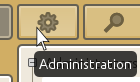

[< Introduction to Maps and TileSets](introduction-to-maps-and-tilesets.md)  

---

# Introduction to Scenes

Scenes are the actual 3D worlds, where all assets (including other scenes) are combined together.

But scenes contains only one kind of object : **game objects**.  
To allow game objects to have different purposes and perform different actions, they are in turn composed of **components**.

Before we go further in the explications, opens the `Scenes` tab and creates a new scene named `Level` (for instance).

Yet again, the interface shows some similarities with the model's and map's interfaces.  
The left column is the list of game objects, _aka_ the __hierarchy__. Create a game object and name it `Player Camera`.  
The right column is the list of components for the selected game object.

- [Components](#components)
- [Building the scene](#building-the-scene)
- [Conclusion](#conclusion)

## Components

Game objects are by default empty and purpose-less objects in the 3D world.  
Their purpose and capabilities (representing the level geometry, a prop, playing a sound, representing an enemy and being killable by the player, etc...) are given by their components.

In CraftStudio, game objects may have up to seven types of components : 

### Transform

This is the "default" component, all game objects always have one transform. You can not create or remove such component, that's why there is no button to create it in the toolbar.    
It is used to represent and manipulate the game object's position, rotation and scale in the scene.

### Camera

A Camera component is a point of view through which you see the world.  
There is two types of cameras : 

- Perspective : the farther away the objects are from the camera, the smaller they appears on screen.
- Orthographic : the perspective is not rendered, so all objects appear the same relative size, whatever their distance to the camera is.

You may have several cameras in the world to render different part of it (ie : one perspective camera for what the player see and one orthographic camera for the HUD), and/or when several players use the same screen (ie : split-screen local multiplayer).

Select the game object you created in the introduction and add a perspective camera to it .  
The lines that appears in the main window represent the camera's **frustrum** (what the camera sees). It changes depending of the type of camera and value of the parameter (field of view or orthographic scale).  
Leave the field of view to 45 for now.

### ModelRenderer, MapRenderer and FontRenderer

These three components' purpose is to display an asset (a model, a map or a font, respectively).  
Once you added the component you can select an asset to display and optionally set its opacity.

Try it now : create a new game object named `Map` and add a map renderer to it, then select the map you created in the previous tutorial.

Now create a third game object named `Steve`, then add a model renderer and set the displayed model to Steve's model.

### Scripts

Scripts are a kind of asset but they can also be added on a game object as a component called `ScriptedBehavior`.  
I won't talk about them now because they are the subject of the next tutorial, but know that scripted behaviors are like reusable, custom components.  
They will be the source of most of the interactions in the game.

### Physics

This component will make the game object react to CraftStudio's physics engine ([BulletPhysics](http://bulletphysics.org)).  
We will use it very soon because this is the physics that will prevent Steve to fall through the map (or fall when there is no block under its feet).

### NetworkSync

This component allows to setup multiplayer features by enabling the game object's scripts to send messages to their counterparts over the network.

## Building the scene

You should already have added three game objects in the scene but it may not looks super cool :

### Parenting

We talked about parenting in the introduction to Models and Animations.  
Parenting of game objects works exactly like the parenting of model's blocks.  
Child objects will move, rotate and be scaled whenever the parent is moved, rotated or scaled.

New game objects are automatically parented to the game object you have currently selected, that's why you probably have your game objects parented to each other, like in the screenshot above.  

Parent a block by clicking and dragging its cartridge over the parent's cartridge (in the hierarchy).  
De-parent a block by clicking and dragging its cartridge over nothing (or between two other cartridges).  
For now, de-parent all three game objects, so that none of them have a parent.

It's also very important to note that the numbers displayed in the transform component are always **relative** to the parent's.  
Move the map's and Steve's game objects at `0, 0, 0`, and make sure that the camera is above them (at `0, 5, 0` for instance).  
Now parent Steve to the player camera : Steve hasn't moved but its position is now `0, -5, 0`.

That's because the displayed position is the **offset** (the difference) from the camera's position.  
The camera is 5 unit above the origin, Steve has a global position of `0, 0, 0`, but a **local** position of `0, -5, 0`, because it is 5 units below the camera (its parent).

The scene is actually already almost over, we just have to place the model over the map and the camera in the air, looking down on the model like in the sceenshot above.  

Once this is done, launch the game to see what the camera sees.  
Click on the `Run Project` button, or press `F5`.  
A window opens to invite you to select the startup scene. Select your scene then click on the `Close` button.  
A new tab called the `Runtime Report` opens in your project then the actual game window opens :

Congratulation you created your first video game !

### Startup scene

When you run the project that way, the game will always load the startup scene until you ask it to load another scene (with a script).  
You can make the game loads to the scene you currently edit by pressing `Ctrl + F5`.

You can also change the startup scene in the `General` tab of the project's administration (open the project's administration from the project's home).

## Conclusion

Scenes are the 3D world, what you actually see through the cameras.  

They are composed of game objects, themselves composed of components (which define the purpose and capabilities of game objects).

Scene and game objects are fully modifiable at runtime by scripts. That's how we will make the world change based on player input.

You may have understood by now that scripts are an important (and complex) topic and a central component of games.  
Thankfully they are the subject of the next chapter !

---

[< Introduction to Maps and TileSets](introduction-to-maps-and-tilesets.md)
