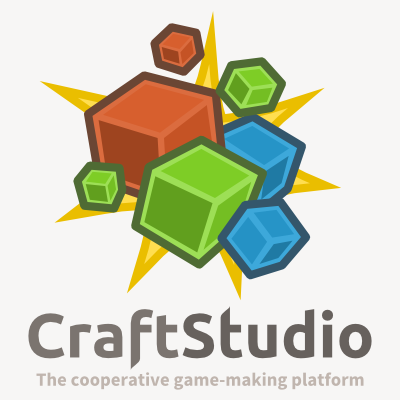
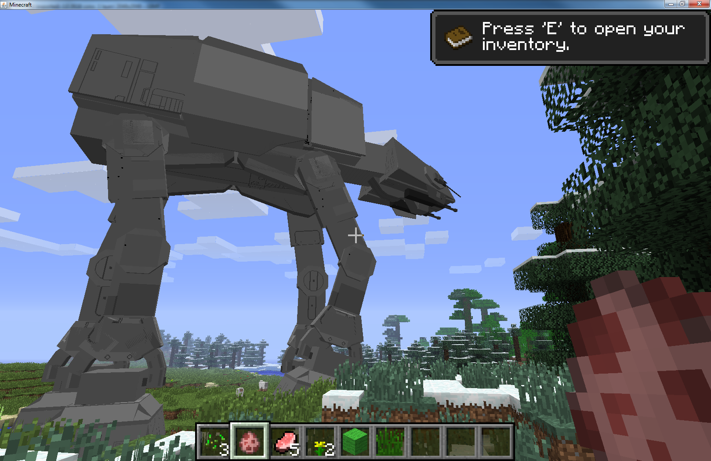

[Introduction to CraftStudio >](introduction-to-craftstudio.md)

---

# Crafting Minecraft in CraftStudio: the Tutorial

In this tutorial, you will learn step-by-step how to use the game making software **CraftStudio** through the development of a Minecraft-like game.

## CraftStudio

Have you ever wanted to create your own video game but don’t have a degree in comptuer science, art or design and know nothing about programming, modeling or level design ?  
Or maybe you do have degrees but don’t really know where to start to make a video game ?  
Maybe you just want to have fun while creating small games for your friends or even with your friends.

**[CraftStudio](http://craftstud.io "Go to CraftStudio's website")** is a cooperative game-making platform, but if it has been marketed as *game to make games*, it’s all but a toy !  
CraftStudio is an all-in-one game development software that let's you create any games while focusing on intuitivity, simplicity and fun !  

No other tool is required, you can create 100% of a game directly within CraftStudio !  
Assets you can create with CraftStudio includes models (with texture and animation), maps (with texture and tile sets), scenes, scripts, fonts, and more.  

And if you are of the social kind, fear not because CraftStudio is multiplayer and you can invite your friends to create a game with you in real time !

CraftStudio is also multi-platform. The editor works on Windows, Mac and Linux and allows you to create games for Windows, Max, Linux or the web (some of the games have even been successfully run on Android but mobile platforms are not officially supported).

CraftStudio offers a full scripting environment, powered by the popular [Lua](http://www.lua.org) scripting language and even provide a visual scripting alternative that let's you build scripts very intuitively by assembling blocks.

### Daneel

**Daneel** is a scripting framework for CraftStudio that I started to develop in 2013.  
Its goals is to bring new functionalities to CraftStudio, extend and render more flexible to use the API as well as sweeten and shorten the code you write.  

Yet this tutorial is focused on CraftStudio itself, Daneel will be used and it's features will be explained as they are encountered.  
In the meantime, you can [learn more about Daneel's features](http://daneel.florentpoujol.fr) on its documentation.

## Minecraft

CraftStudio has very often been compared to Minecraft because they both share a lot of ideologies and looks.  
CraftStudio also got a lot of publicity from the Minecraft community because it allows to create models and easily export them to be used in Minecraft.  
Finally, CraftStudio has most notably been exibited at the *Minecon* 2012 as well as at *Des Cubes et Des Pioches*, another Minecraft convention in 2013. 

The relations between CraftStudio and Minecraft are still strong and this tutotrial will make no exceptions.  
Also, Minecraft is interesting because it is very popular, so even if you didn't played to it, you probably have a good idea of what it is, what it looks like and how you play it.  

## Who is this tutorial for ?

Anyone who would like to learn CraftStudio or get a good idea of its capabilities.  

It is not particularly intended for newcomers in game development as the difficulty of each chapter will varies a lot and won't really follow a learning curve.  
Most of all, even if the scripts will be explained, it won't teach you how to code and it requires you to be already familiar with Lua (which hopefully [can be learned very quickly](http://stackoverflow.com/a/8097810/1977849) ).

## Work In Progress

All these tutorials are in heavy work in progress, and are thus subject to change/improvements.  
As I am not a native english speaker and despite my best efforts, the tutorials surely contains orthographic and grammatical errors, as well as wrong expressions.

## Table of content

- [Introduction to CraftStudio](introduction-to-craftstudio.md)
- [Introduction to Models and Animations](introduction-to-models-and-animations.md)
- [Introduction to Maps and TileSets](introduction-to-maps-and-tilesets.md)
- [Introduction to Scenes](introduction-to-scenes.md)  

---

[Introduction to CraftStudio >](introduction-to-craftstudio.md)
