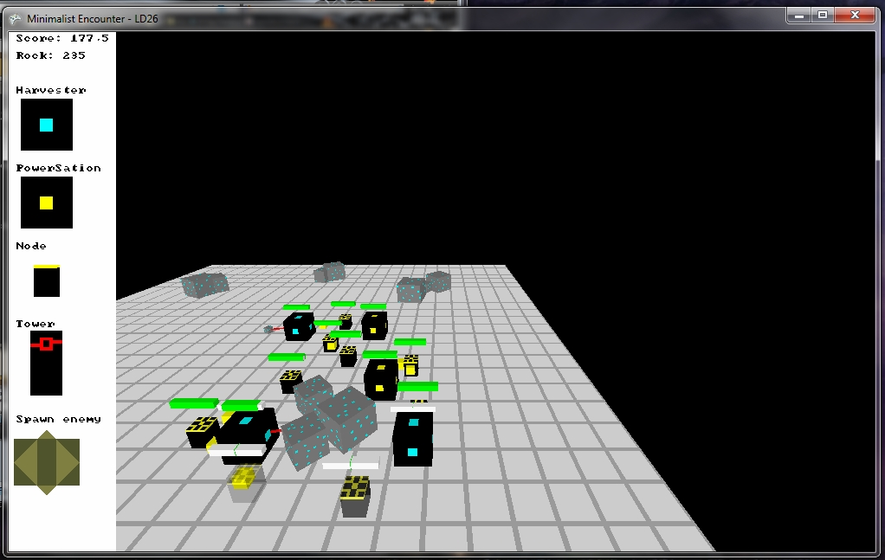
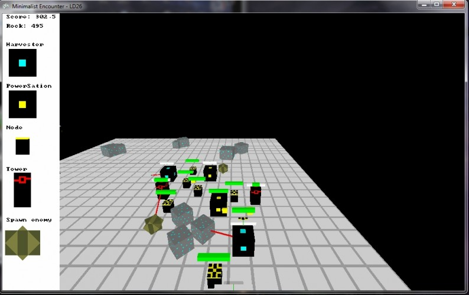
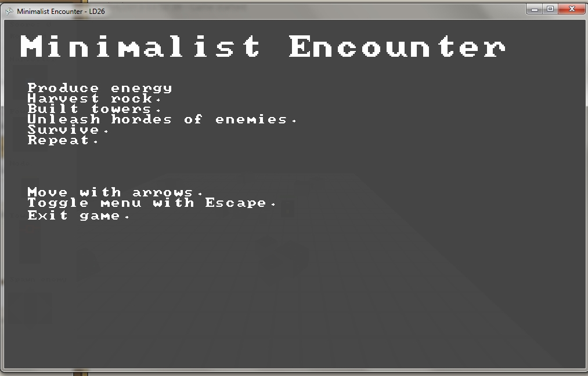

# Minimalist Encounter

A simpler clone of "Harvest: Massive Encounter" (by Oxeye Games).
Collect rocks, built a power grid and towers to defend yourself against enemies.

Originally made for the Ludum Dare 26 Compo.  
http://ludumdare.com/compo/ludum-dare-26/?action=preview&uid=14207

Updated to be an example project for Daneel v1.3.
So this is the post-compo version.

