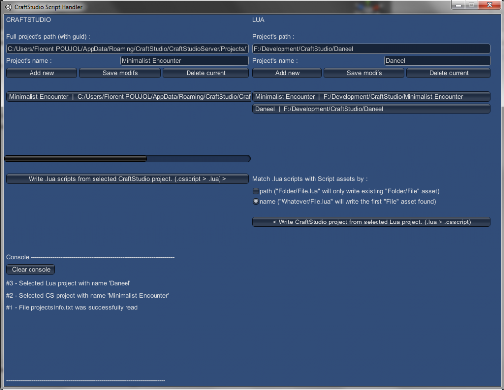

# CraftStudio Script Handler

This app can convert [CraftStudio](http://craftstud.io)'s Script assets (.csscript) to regular Lua scripts (`.lua`) and vice-versa.

The app can read a CraftStudio project and create a `.lua` version of all of the project's scripts.  
It can also read `.lua` scripts and write the corresponding Script asset in a CraftStudio project.

The script's public properties may be modified from the `.lua` version.

## Download

Check the `build` folder.

## How to use

You can set several "CraftStudio project" and "Lua project", identified by a path and name.

Select a CraftStudio project and a Lua project then click one of the buttons to begin the conversion.

Be advised of the following limitations :

- Your local CraftStudio server has to be stopped to read from or write to a CraftStudio project.
- The app only reads and writes the current version of the Script assets (the "Current" revision).
- The app never creates, moves or deletes scripts in the CraftStudio project so it only writes a Script asset from a `.lua` script when the path, or name matche.
- When writing `.lua` scripts, the app does not deletes or moves existing scripts, it just creates missing scripts or overwrite existing ones.
- Indentations in the `.lua` scripts must use (4) spaces, not tabs.

## Public properties

The asset's public properties (if any) are found at the top of the `.lua` scripts and follow this pattern :

    --[[PublicProperties
    name type defaultValue
    /PublicProperties]]

- The name, type and defaultValue must be separated by at least one space and must exist on the same line.
- The type may be `boolean`, `number` or `string`.
- When the property is of type `string`, its value must be enclosed in double quotation marks (`"`).
- You may delete, move or modify any existing properties or add new properties.

Ie :

    --[[PublicProperties
    isAlive boolean true
    health  number  52.8
    name string "John"
    /PublicProperties]]

## Credits

Copyright © 2013-2014 Florent POUJOL
http://florentpoujol.fr

Permission is hereby granted, free of charge, to any person obtaining a
copy of this software and associated documentation files (the "Software"),
to deal in the Software without restriction, including without limitation
the rights to use, copy, modify, merge, publish, distribute, sublicense,
and/or sell copies of the Software, and to permit persons to whom the
Software is furnished to do so, subject to the following conditions:

The above copyright notice and this permission notice shall be included in
all copies or substantial portions of the Software.

THE SOFTWARE IS PROVIDED "AS IS", WITHOUT WARRANTY OF ANY KIND, EXPRESS OR
IMPLIED, INCLUDING BUT NOT LIMITED TO THE WARRANTIES OF MERCHANTABILITY,
FITNESS FOR A PARTICULAR PURPOSE AND NONINFRINGEMENT. IN NO EVENT SHALL THE
AUTHORS OR COPYRIGHT HOLDERS BE LIABLE FOR ANY CLAIM, DAMAGES OR OTHER
LIABILITY, WHETHER IN AN ACTION OF CONTRACT, TORT OR OTHERWISE, ARISING
FROM, OUT OF OR IN CONNECTION WITH THE SOFTWARE OR THE USE OR OTHER
DEALINGS IN THE SOFTWARE.
