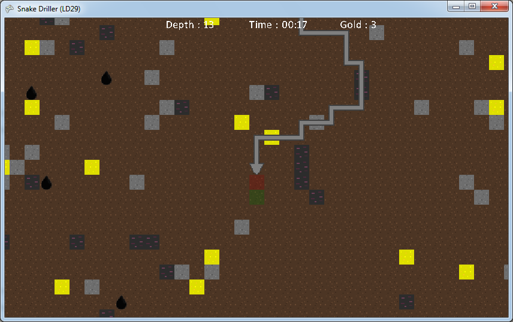

# Snake Driller

A game I made for the [Ludum Dare #29 Compo](http://www.ludumdare.com/compo/ludum-dare-29) (theme : _Beneath the surface_) in less than 16 hours during 26-28th of April 2014.

## Tools

- The [CraftStudio](http://craftstud.io) middleware
- My [Daneel Framework](https://static.florentpoujol.fr/daneel) for CraftStudio
- My [simple hosted leaderboard](https://github.com/florentpoujol/CraftStudio-Leaderboard) library

## Download

Screenshots and Windows, Mac and Linux executables can be found [on the Ludum Dare website](http://www.ludumdare.com/compo/ludum-dare-29/?action=preview&uid=14207).

